# Promox

Nombre: Juan Felipe Criollo Valderrama

### Documentación

## Creacion de maquinas Hyper-V

1. Seleccionamos Nuevo/ Maquina Virtual...
2. Le ponemos el Nombre: Nodo1
3. Seleccionamos la Generacio


5. Configuramos la Memoria de Inicio 
* 4096MB Nodo1
* 4096MB nodo2
6. Configuramos la Conexion
   


7. Seleccionamos Instalar un sistema operativo desde un CD/DVD-ROM de arranque/ Archivo de imagen (.iso):
* seleccionamos la iso de Promox


8. seleccionamos siguiente/ terminar
9. cconfiguramos para que tenga 4 procesadores
10. se repite todo para el Nodo2

---

## Power shell
* entramos a power sheell como administrador
* Habilitamos la virtualización anidada con este comando 


```
Set-VMProcessor -VMName "Nodo1" -ExposeVirtualizationExtensions $true
```
```
Set-VMProcessor -VMName "Nodo2" -ExposeVirtualizationExtensions $true
```

---

## Instalacion de los Nodos

1. seleccionamos Install Promox VE (Graphical)


2. Configuramos el idioma y la zona


3. Ingresamos un correo y contraseña


4. Configuramos la red
   
HotsName | Pve1 | Pve2
-------- | ---- | ------------
Ip Address |  172.30.240.10/20 | 172.30.240.11/20
Gateway | 172.30.240.1 | 172.30.240.1
DNS Sever | 8.8.8.8 | 8.8.8.8


6. seleccionamos instalar
* quitamos la ISO para no volverlo a instalar
  
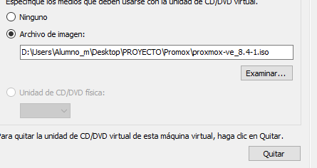

7. Iniciamos la M Virtual
   
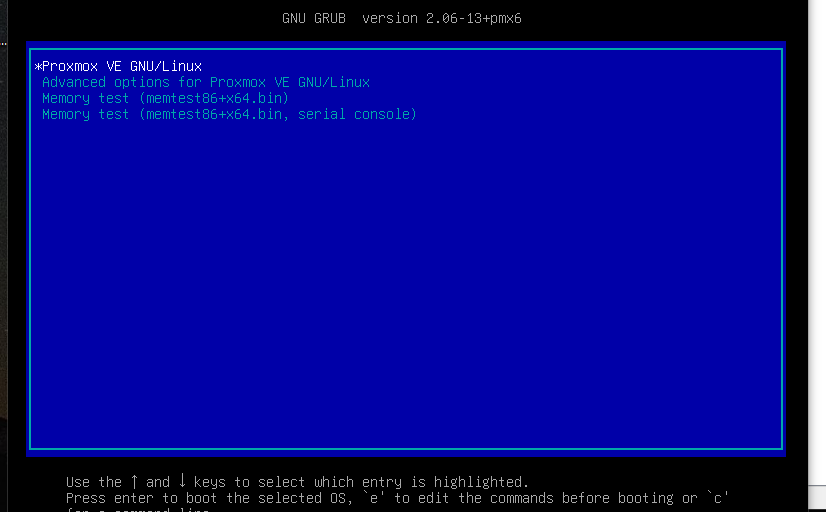

* Ingresamos el usuario root con la contaseña
* Ingresamos la URL al Navegador
  
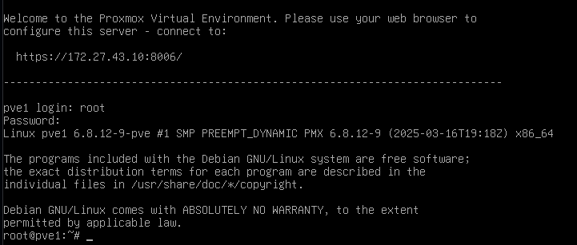

--- 

## Crear el Cluster en Promox
* Accedemos a la vía Web de Promox:

Pve1 | Pve2
---- | ----------------------
https://<172.30.240.10>:8006. | https://<172.30.240.11>:8006.

* Nodo1: Datacenter -> Cluster -> Create Cluster ( nombre cluster-pve).

  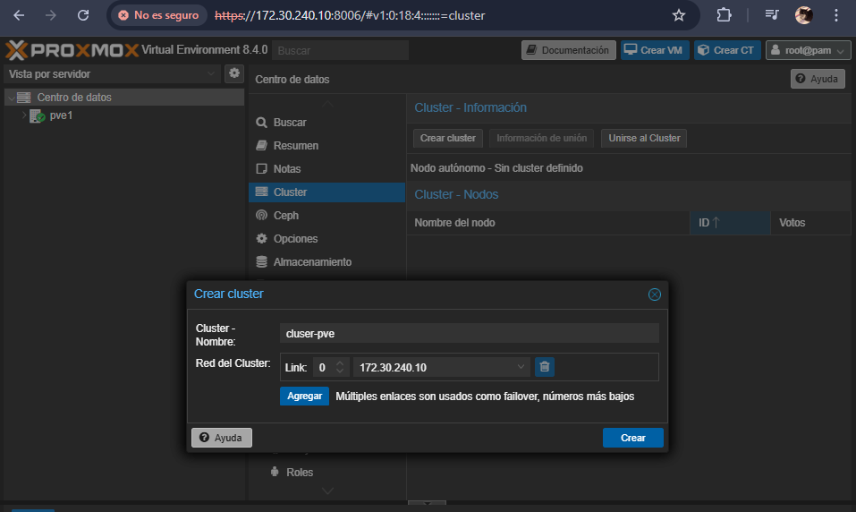

* Nodo2: Datacenter -> Cluster -> Join Cluster (ingresamos la  informacion de union del Nodo1, ingresar IP del Nodo1 y contraseña de root).

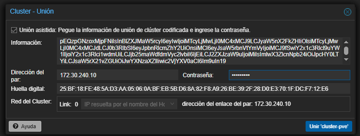

* Verificación: Ambos nodos aparecen en Datacenter -> Cluster.

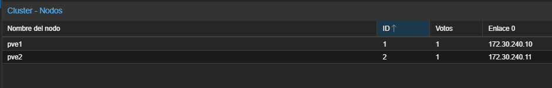

---

## Creamos Almacenamiento Compartido (NFS)

1.Crear VM para NFS:
* Nombre: NFS
* Ubuntu Server Minimal (900 MB RAM, 10 GB disco).
* Configuramos la Red: Default Switch.
* Instalar y Configurar NFS:
  
2. Instalacion del Sever
* Try or Install Ubuntu Server
  
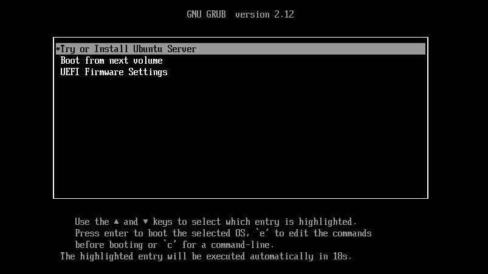

* Seleccionamos el idioma y el teclado (Español) 
* Seleccionamos UBUNTU Server(minized)
  
  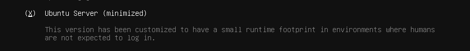

* Red se deja en automatico DHCP
  
  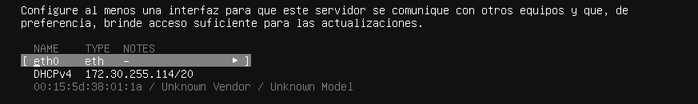

* Configuramos EL Nombre del servidor y el del usuario

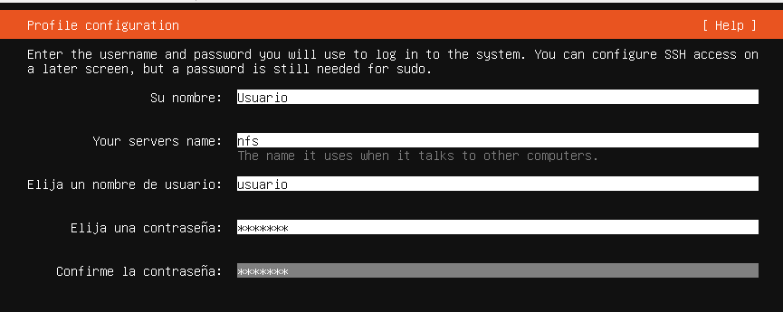

* Reiniciamos ahora
  
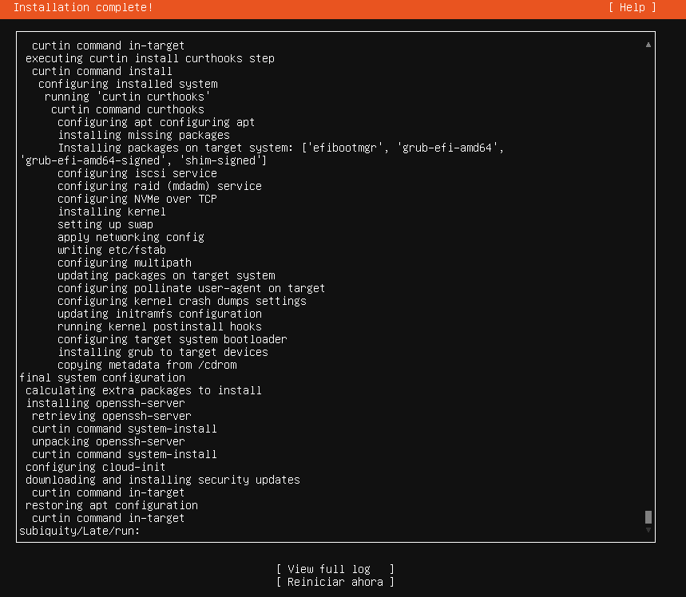

3. Instalar y Configurar NFS:

```
sudo apt update && sudo apt install nfs-kernel-server -y
sudo mkdir /srv/pve-shared
sudo nano /etc/exports
```

* Añadimos en /etc/exports:
  
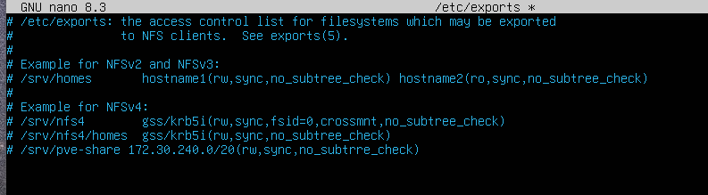
```
/srv/pve-shared 192.168.137.0/24(rw,sync,no_subtree_check)
```
* Reiniciar servicio:

```
sudo systemctl restart nfs-kernel-server.
```

3. Añadir NFS a Proxmox:
* En la web de Proxmox: Datacenter -> Storage -> Add -> NFS.
* ID: nfs-shared.
* Server: IP de la VM NFS-Server.
* Export: /srv/pve-shared.
  
