# Promox

Nombre: Juan Felipe Criollo Valderrama

### Documentación

## Creacion de maquinas Hyper-V

1. Seleccionamos Nuevo/ Maquina Virtual...
2. Le ponemos el Nombre: Nodo1
3. Seleccionamos la Generacio


5. Configuramos la Memoria de Inicio 
* 4096MB Nodo1
* 4096MB nodo2
6. Configuramos la Conexion
   


7. Seleccionamos Instalar un sistema operativo desde un CD/DVD-ROM de arranque/ Archivo de imagen (.iso):
* seleccionamos la iso de Promox


8. seleccionamos siguiente/ terminar
9. cconfiguramos para que tenga 4 procesadores
10. se repite todo para el Nodo2

---

## Power shell
* entramos a power sheell como administrador
* Habilitamos la virtualización anidada con este comando 


```
Set-VMProcessor -VMName "Nodo1" -ExposeVirtualizationExtensions $true
```
```
Set-VMProcessor -VMName "Nodo2" -ExposeVirtualizationExtensions $true
```

---

## Instalacion de los Nodos

1. seleccionamos Install Promox VE (Graphical)


2. Configuramos el idioma y la zona


3. Ingresamos un correo y contraseña


4. Configuramos la red
   
HotsName | Pve1 | Pve2
-------- | ---- | ------------
Ip Address |  172.30.240.10/20 | 172.30.240.11/20
Gateway | 172.30.240.1 | 172.30.240.1
DNS Sever | 8.8.8.8 | 8.8.8.8


6. seleccionamos instalar
* quitamos la ISO para no volverlo a instalar
  


7. Iniciamos la M Virtual
   


* Ingresamos el usuario root con la contaseña
* Ingresamos la URL al Navegador
  


--- 

## Crear el Cluster en Promox
* Accedemos a la vía Web de Promox:

Pve1 | Pve2
---- | ----------------------
https://<172.30.240.10>:8006. | https://<172.30.240.11>:8006.

* Nodo1: Datacenter -> Cluster -> Create Cluster ( nombre cluster-pve).

  

* Nodo2: Datacenter -> Cluster -> Join Cluster (ingresamos la  informacion de union del Nodo1, ingresar IP del Nodo1 y contraseña de root).


* Verificación: Ambos nodos aparecen en Datacenter -> Cluster.


---

## Creamos Almacenamiento Compartido (NFS)

1.Crear VM para NFS:
* Nombre: NFS
* Ubuntu Server Minimal (900 MB RAM, 10 GB disco).
* Configuramos la Red: Default Switch.
* Instalar y Configurar NFS:
  
2. Instalacion del Sever
* Try or Install Ubuntu Server
  


* Seleccionamos el idioma y el teclado (Español) 
* Seleccionamos UBUNTU Server(minized)
  
  

* Red se deja en automatico DHCP
  
  

* Configuramos EL Nombre del servidor y el del usuario


* Reiniciamos ahora
  


3. Instalar y Configurar NFS:

```
sudo apt update && sudo apt install nfs-kernel-server -y
```
* Creamos la carpeta para compartir
```
sudo mkdir -p /srv/nfs/compartido
```
* Le cambiamos el grupo
```
sudo chown nobody:nogroup /srv/nfs/compartido
```
* Le damos permisos
```
sudo chmod 777 /srv/nfs/compartido
```
* Abrimos
```
sudo nano /etc/exports
```

* Añadimos en /etc/exports:
  


```
/srv/compartido 172.27.32.10(rw,sync,no_subtree_check)
/srv/compartido 172.27.32.11(rw,sync,no_subtree_check)
```
* Exportamos
```
sudo exporfs -a
```
* Reiniciar servicio:

```
sudo systemctl restart nfs-kernel-server.
```

3. Añadir NFS a Proxmox:
* En la web de Proxmox: Datacenter -> Storage -> Add -> NFS
* ID: compartido
* Server: 
* Export: /srv/nfs/compartido.
* Contenido: Imagen del disco, Plantilla de contenedor, Imagen ISO

---
  
## Creacion y configuacion de Contenedores LXC

1. configuramos la conexion a internet en los Contenedores (MV Nodo1).
* Configuramos este archivo /etc/network/interfaces
```
sudo nano  /etc/network/interfaces
```
```
auto vmbr1
iface vmbr1 inet statict
    address 172.30.240.10
    netmask 255.255.0.0
    bridge_ports none
    bridge_stp off
    bridge_fd 0
    post-up echo 1 > /proc/sys/net/ipv4/ip_forward
    post-up iptables -t nat -A POSTROUTING -s '172.30.240.0/20' -o vmbr0  -j MASQUERADE
    post-down iptables -t nat -D POSTROUTING -s '172.30.240.0/20' -0 vmbr0 -j MASQUERADE
```

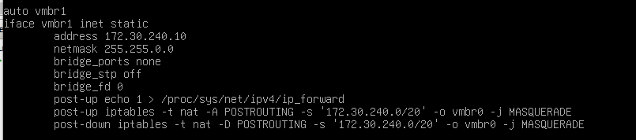

* Ahora configuramos este arhcivo /etc/sysctl.conf y descomentamos esto
```
net.ipv4.ip_forward=1
```
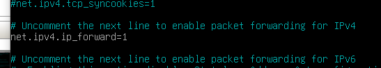

*  Ponemos esto para aplicar los cambios
```
sysctl -p
```
```
ifreload -a
```
```
systemctl restart networking
```

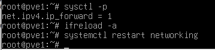

2. Descargar la plantilla (Nodo1).
* Actualizamos la lista de plantillas disponibles:
```
pveam update
```
* Visualizamos las plantillas disponibles
```
pveam available | more
```
* Descargamos la plantilla al almacenamiento (compartido):
```
pveam download compartido debian-12-turnkey-zoneminder_18.0-1_amd64.tar.gz
```

4. Crear Contenedores:

4.1 Contenedor1:
*  Configuramos  el CT ID, Nombre del Host, Nodo y ponemos la contraseña
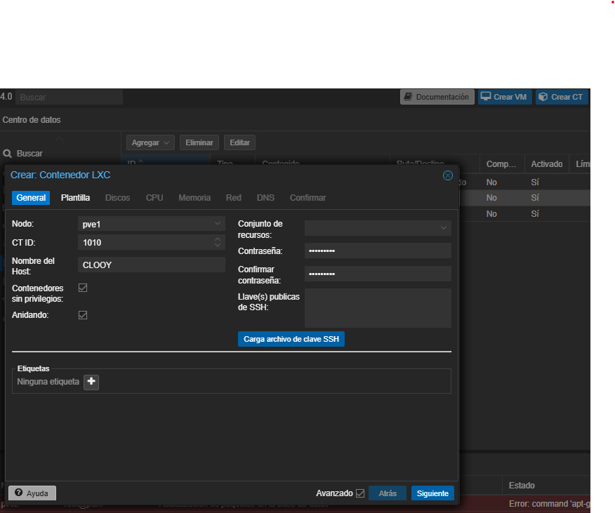 

* seleccionamos la plantilla y el alamcenamiento 
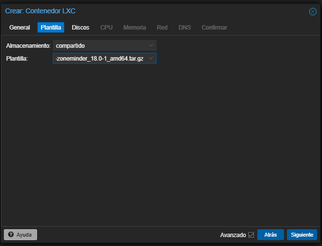

* Se deja en predeterminado 
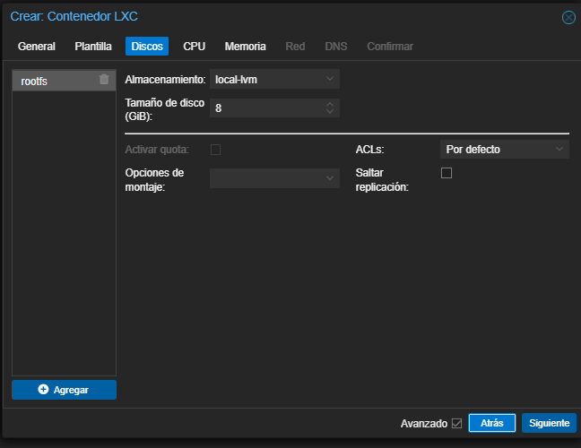

* Le ponemos 2 Nucleos 
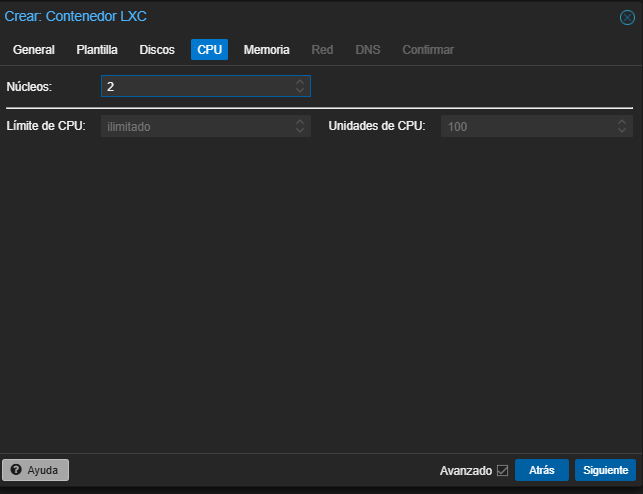

* Se deja en predeterminado
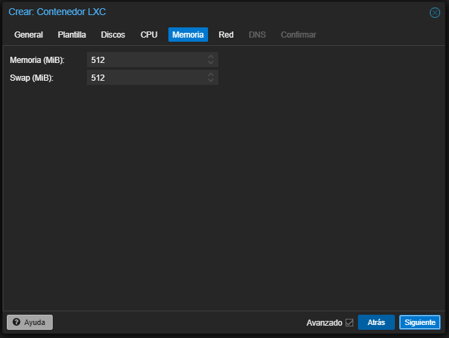

*  Configuramos el Puente, Ponemos la IPv4 y el gateway
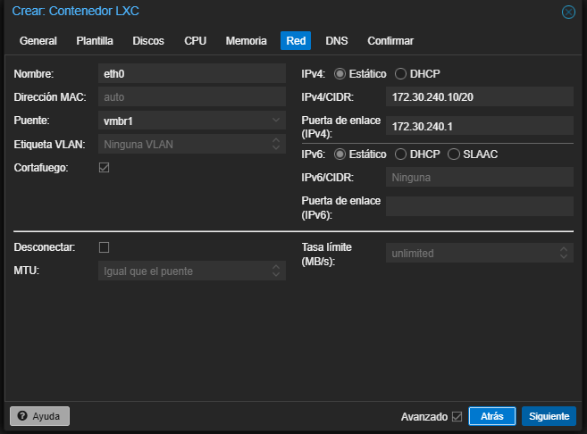

* Se deja predeterminado
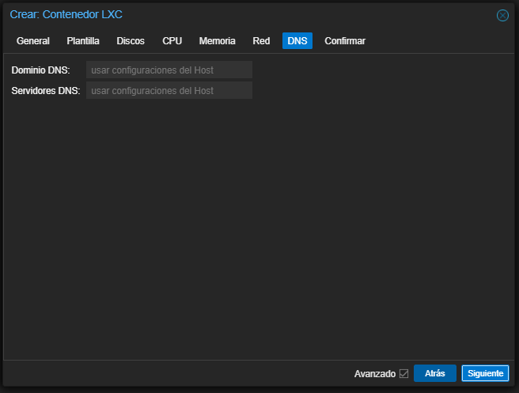

* Revisamos y le damos a terminar
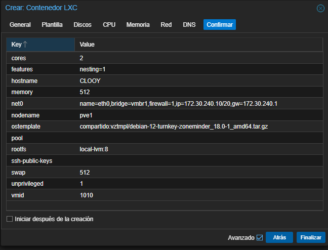
