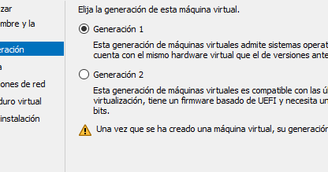
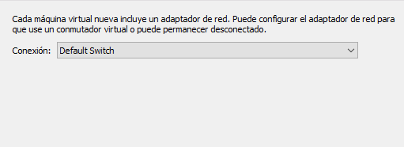
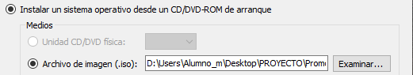
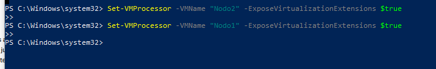
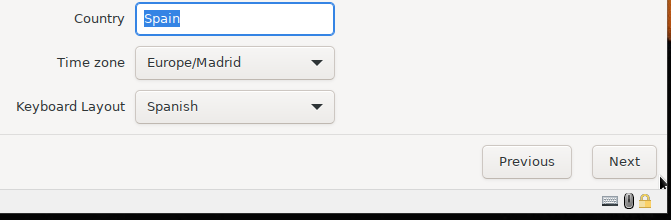
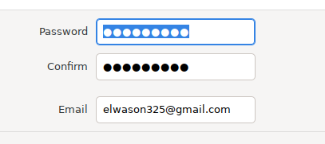
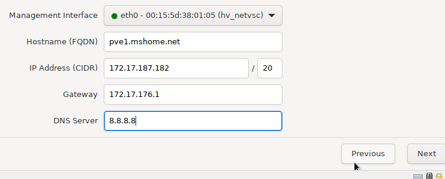

# Promox

Nombre: Juan Felipe Criollo Valderrama

### Documentación

## Creacion de maquinas Hyper-V

1. Seleccionamos Nuevo/ Maquina Virtual...
2. Le ponemos el Nombre: Nodo1
3. Seleccionamos la Generacio

5. Configuramos la Memoria de Inicio 
* 5000MB Nodo1
* 4500MB nodo2
6. Configuramos la Conexion
   

7. Seleccionamos Instalar un sistema operativo desde un CD/DVD-ROM de arranque/ Archivo de imagen (.iso):
* seleccionamos la iso de Promox

8. seleccionamos siguiente/ terminar
9. cconfiguramos para que tenga 4 procesadores
10. se repite todo para el Nodo2

---

## Power shell

---
## Instalacion de los Nodos

1. seleccionamos Install Promox VE (Graphical)

2. Configuramos el idioma y la zona

3. Ingresamos un correo y contraseña

4. Configuramos la red

